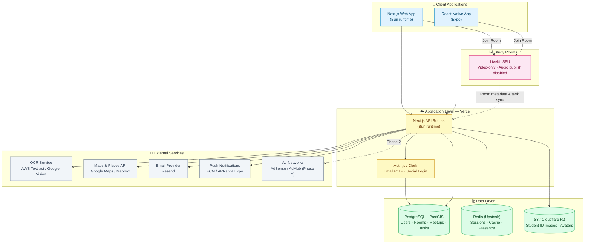
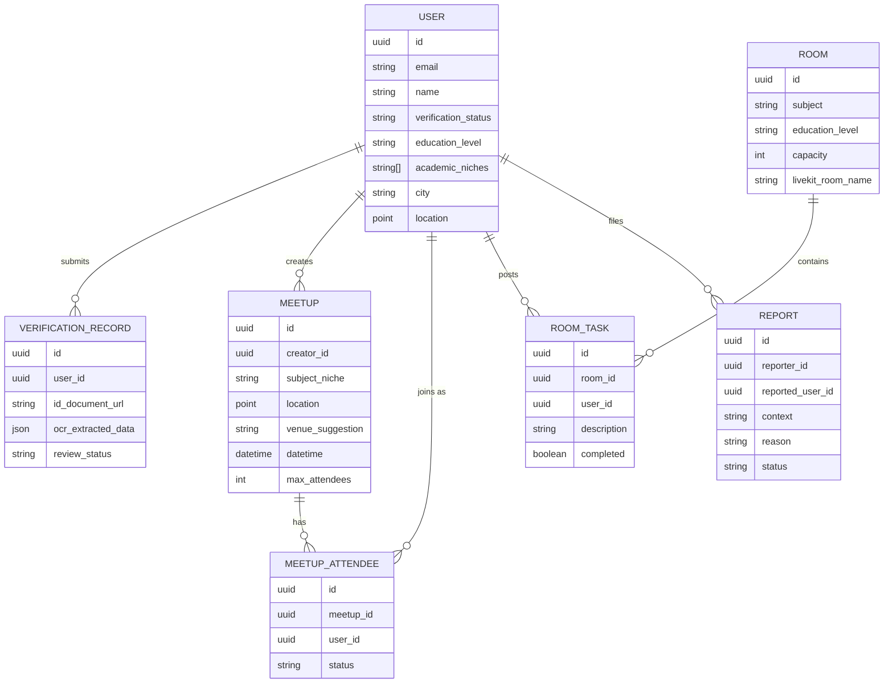
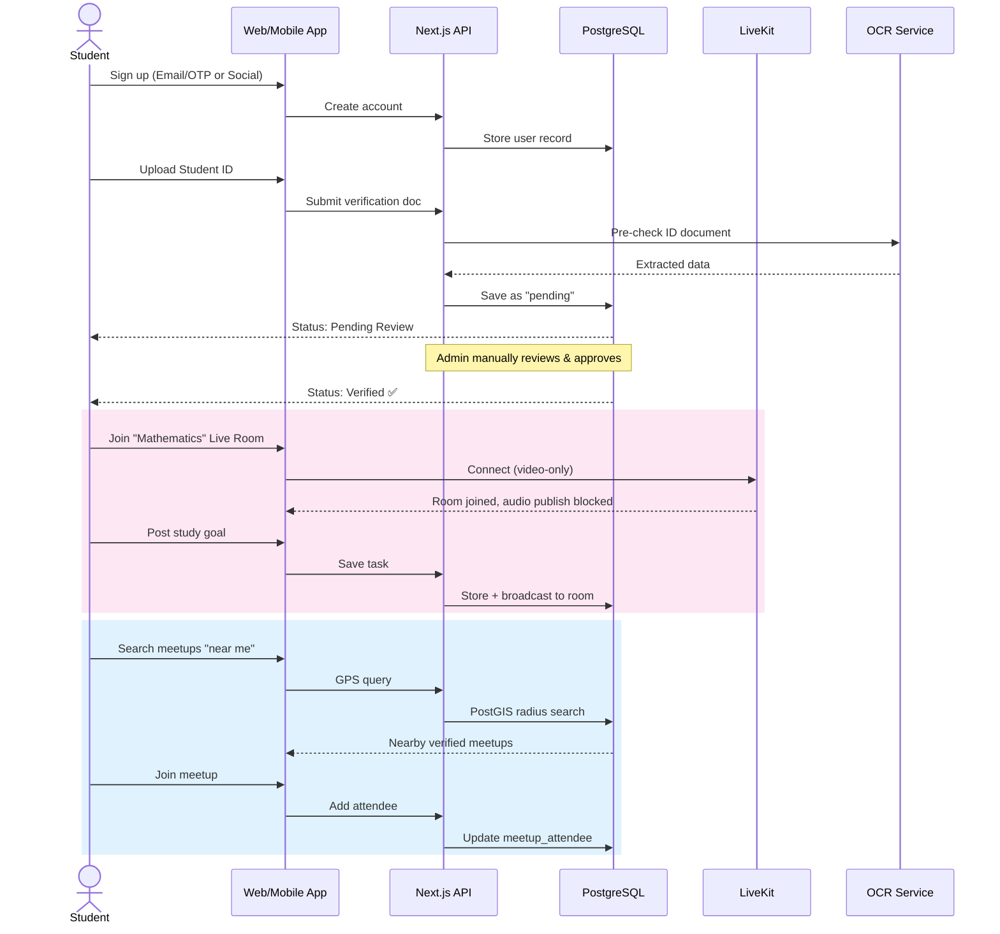

<div align="center">

# 📚 Student Meet

### *Find your study tribe — online or offline.*

A social platform where students pair up for real-world study sessions and join subject-based, video-only live study rooms to stay focused, motivated, and connected.

[]()
[]()
[]()
[]()

</div>

---

## 📖 Table of Contents

- [Overview](#-overview)
- [Core Features](#-core-features)
- [System Architecture](#-system-architecture)
- [Tech Stack](#-tech-stack)
- [Data Model](#-data-model-core-entities)
- [User Flow](#-user-flow)
- [Project Structure](#-project-structure)
- [Getting Started](#-getting-started)
- [Roadmap](#-roadmap)
- [Documentation](#-documentation)
- [Risk Areas & Considerations](#-risk-areas--considerations)

---

## 🌟 Overview

**Student Meet** helps students from any academic background — school, college, or competitive exam prep — beat isolation and stay consistent with their studies. It does this in two ways:

| 🤝 Study-Out Meetups | 🎥 Live Study Rooms |
|---|---|
| Verified students plan and join **offline study sessions** at nearby libraries, cafes, and study spots — found via GPS or manual city/area search. | Subject- and level-based **virtual rooms** (Science, Mathematics, History, etc.) where students sit on video — **audio always off** — and work alongside each other with shared, visible study goals. |

The platform is **free for everyone** at launch, with ad-based monetization planned for a later phase.

---

## ✨ Core Features

- 🆔 **Multi-layer verification** — email/OTP, social login, college email domain check, and student ID upload (OCR + manual review)
- 📍 **Location-aware meetups** — GPS-based discovery with manual city/area override, plus nearby library/study-spot suggestions
- 🎯 **Shared goals in live rooms** — every participant's tasks are visible to the room for accountability
- 🔇 **Audio-free by design** — no audio publishing capability at all, enforced at the infrastructure level
- 📱 **True cross-platform** — single experience across Web (Next.js) and Mobile (React Native/Expo)
- 🛡️ **Safety-first** — reporting, blocking, and admin moderation tools built in from day one

---

## 🏗 System Architecture



> **Note:** Audio is never published from any client into LiveKit — there is no audio track creation path in the client SDKs for study rooms, ensuring the "no-audio" policy is structural, not just a UI toggle.

---

## 🧰 Tech Stack

| Layer | Technology |
|---|---|
| **Web Frontend** | Next.js (App Router), Tailwind CSS, Zustand, TanStack Query, React Hook Form + Zod |
| **Mobile Frontend** | React Native (Expo), React Navigation, Expo Location/Camera/Notifications |
| **Backend** | Next.js API Routes on **Bun** runtime |
| **Database** | PostgreSQL + PostGIS, via **Drizzle ORM** |
| **Caching** | Redis (Upstash) |
| **Video** | **LiveKit** (self-hostable SFU, video-only enforcement) |
| **Auth** | Auth.js / Clerk — Email+OTP, Google/Apple login, college email verification |
| **Storage** | AWS S3 / Cloudflare R2 |
| **OCR** | AWS Textract / Google Vision |
| **Maps** | Google Maps / Mapbox |
| **Hosting** | Vercel (app), Neon/Supabase (DB), LiveKit Cloud → self-hosted |
| **Monitoring** | Sentry + PostHog |

📄 Full breakdown in [`01. Tech-Stack.md`](./01.%20Tech-Stack.md)

---

## 🗂 Data Model (Core Entities)



---

## 🔄 User Flow



---

## 📁 Project Structure

```
student-meet/
├── apps/
│   ├── web/                 # Next.js web app (Bun runtime)
│   │   ├── app/              # App Router pages & API routes
│   │   ├── components/
│   │   └── lib/
│   └── mobile/               # React Native (Expo) app
│       ├── app/
│       ├── components/
│       └── lib/
├── packages/
│   ├── shared/               # Shared types, Zod schemas, constants
│   ├── db/                    # Drizzle schema & migrations
│   └── ui/                    # Shared UI primitives (where feasible)
├── docs/
│   ├── 01. Tech-Stack.md
│   ├── 02. Project-Execution.md
│   └── 03. system-requirements.md
└── README.md
```

---

## 🚀 Getting Started

```bash
# Clone the repository
git clone https://github.com/your-org/student-meet.git
cd student-meet

# Install dependencies (Bun workspaces)
bun install

# Set up environment variables
cp .env.example .env
# Fill in: DATABASE_URL, LIVEKIT_API_KEY, LIVEKIT_API_SECRET,
#          AUTH secrets, MAPS_API_KEY, OCR credentials, etc.

# Run database migrations
bun run db:migrate

# Start the web app
bun run dev:web

# Start the mobile app (Expo)
bun run dev:mobile
```

> ⚠️ This is a planning-stage README — commands assume the monorepo structure proposed in [`02. Project-Execution.md`](./02.%20Project-Execution.md) and will need actual scripts wired up during Phase 0.

---

## 🗺 Roadmap

| Phase | Focus | Status |
|---|---|---|
| 0 | Foundation & Planning | 🟡 Planned |
| 1 | Authentication & Verification | ⚪ Not started |
| 2 | Live Study Rooms MVP | ⚪ Not started |
| 3 | Study-Out Meetups | ⚪ Not started |
| 4 | Mobile Parity & Polish | ⚪ Not started |
| 5 | Beta Launch | ⚪ Not started |
| 6 | Public Launch & Monetization Prep | ⚪ Not started |

📄 Full plan in [`02. Project-Execution.md`](./02.%20Project-Execution.md)

---

## 📚 Documentation

| Document | Description |
|---|---|
| [`01. Tech-Stack.md`](./01.%20Tech-Stack.md) | Detailed breakdown of every technology choice and why |
| [`02. Project-Execution.md`](./02.%20Project-Execution.md) | Phase-by-phase execution plan, team structure, timelines |
| [`03. system-requirements.md`](./03.%20system-requirements.md) | Functional & non-functional requirements, constraints, data model |

---

## ⚠️ Risk Areas & Considerations

- **Verification bottleneck** — manual ID review introduces human-dependent latency; plan automation as scale grows
- **Video infrastructure cost** — monitor LiveKit Cloud usage and define a clear self-hosting migration trigger
- **Offline safety** — real-world meetups require robust verification, reporting, and moderation before public launch
- **No-audio policy** — must be enforced structurally (no audio track publishing path in client SDKs), not just hidden in UI
- **Engagement** — the shared goals/tasks feature is central to retention and needs thorough beta validation

---

<div align="center">

*Built for students, by design — focused, social, and free.*

</div>
